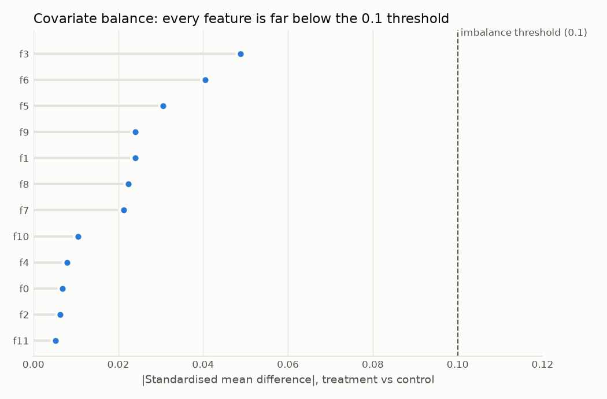
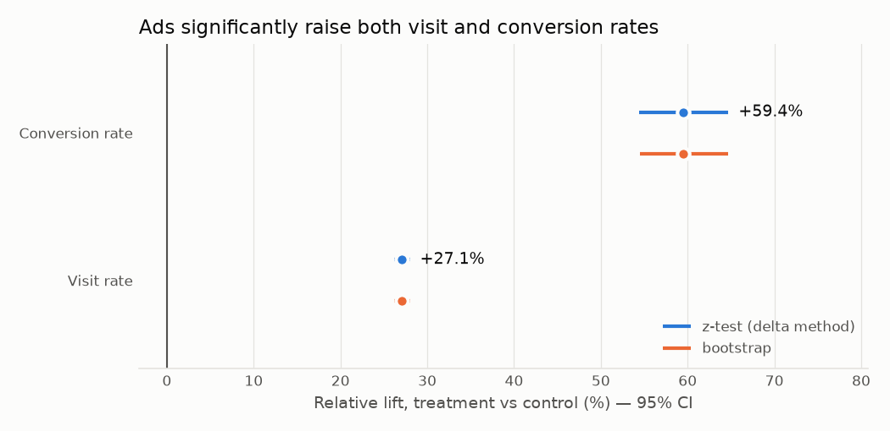

# Does Ad Exposure Drive Incremental Visits? — A/B Test & Uplift Analysis on 14M Users (PySpark)

> **Business question:** Criteo ran a randomized ad-incrementality test. How many *extra* visits and
> conversions do ads actually cause, which users respond best, and who should we target?

**Status:** 🚧 in progress — Steps 1–3 of 7 done.

| Step | What | Status | Report |
|---|---|---|---|
| 1 | PySpark ingestion, data-quality profile, Parquet | ✅ | [01_data_profile.md](reports/01_data_profile.md) |
| 2 | Experiment validity: SRM test, covariate balance | ✅ | [02_validity.md](reports/02_validity.md) |
| 3 | Core A/B analysis: z-test + bootstrap CIs for visit & conversion | ✅ | [03_ab_results.md](reports/03_ab_results.md) |
| 4 | Power & minimum detectable effect | ⏳ | |
| 5 | Assignment vs. exposure: ITT vs. CACE | ⏳ | |
| 6 | Heterogeneous effects & T-learner uplift model (Qini) | ⏳ | |
| 7 | Streamlit dashboard & write-up | ⏳ | |

## Key results so far

> **Headline:** Ads lift the visit rate by **+27.1%** (95% CI 26.2–28.0%) and the conversion rate by
> **+59.4%** (95% CI 54.4–64.7%) — about **123K incremental visits** and **13.7K incremental
> conversions** across 11.9M users assigned to see ads. Randomisation checks pass.

### 1. Data: 13.98M users, clean, processed in ~60s with PySpark
- **13,979,592** users; **0** missing values; all binary columns valid.
- Treatment 11,882,655 (85%) vs. control 2,096,937 (15%).
- Overall visit rate **4.70%**, conversion rate **0.29%**, exposure rate **3.06%** — only
  **~3.6% of treated users actually saw an ad**, which matters for Step 5 (ITT vs. CACE).
- Integrity checks: **0** control users exposed to the ad, **0** conversions without a visit.
- 9.0% of rows are exact duplicates. They are **kept**: each row is a distinct user and the
  anonymised features collide naturally; dropping them would bias the rates.

### 2. Randomisation is valid → treatment effects can be trusted
- **No sample ratio mismatch.** Observed treatment share 85.00001% vs. designed 85%
  (χ² = 1.8e-6, p = 0.999). The split is almost *too* exact — the public release was most likely
  subsampled to the target ratio, so this test confirms the data was prepared consistently rather
  than proving the live randomiser was perfect.
- **Covariates are balanced.** All 12 features have |SMD| < 0.1 (largest: f3, 0.049); variance
  ratios 0.99–1.32.
- **Why SMD and not p-values:** all 12 Welch t-tests are "significant" (p < 0.05) purely because of
  sample size — with 14M users even a 0.01-SD difference is detectable. Balance is judged on effect
  size, not significance.



### 3. Ads cause +27% visits and +59% conversions (intent-to-treat)

| Metric | Control | Treatment | Abs. lift | Rel. lift (95% CI) | p-value |
|---|---|---|---|---|---|
| Visit | 3.820% | 4.854% | +1.034 pp | **+27.1%** (26.2%, 28.0%) | < 1e-300 |
| Conversion | 0.194% | 0.309% | +0.115 pp | **+59.4%** (54.4%, 64.7%) | 7e-179 |

- **Two methods, same answer:** two-proportion z-test (delta-method CI for relative lift) and a
  10,000-replicate bootstrap agree to within 0.2 percentage points of lift.
- **Efficient bootstrap:** with binary outcomes and i.i.d. users, resampling *n* users gives a
  Binomial(*n*, p̂) success count, so replicates are drawn from that distribution — equivalent to a
  row-level bootstrap without rescanning 14M rows 10,000 times.
- **Signal vs noise:** conversion is ~20× rarer than a visit, so its relative-lift CI is ~5.6×
  wider (10.3 vs 1.8 pts). Visit is the sharper signal; conversion is the business outcome.
- These are **intent-to-treat** effects: only ~3.6% of assigned users actually saw an ad, so the
  effect on users who *were* exposed is much larger (Step 5).



## Data

[Criteo Uplift Prediction Dataset v2.1](https://huggingface.co/datasets/criteo/criteo-uplift):
~13.98M users, 12 anonymised features (`f0`–`f11`), `treatment` (≈85% treated),
`visit`, `conversion`, `exposure`. License: CC-BY-NC-SA 4.0 (non-commercial). The data is not
redistributed in this repo — `scripts/00_download_data.sh` fetches it.

## Project structure

```
├── scripts/
│   ├── 00_download_data.sh        # fetch raw data from Hugging Face
│   ├── make_sample_data.py        # tiny synthetic file with the same schema (for quick runs / CI)
│   ├── 01_ingest_and_profile.py   # Step 1: PySpark ingest -> profile -> Parquet
│   ├── 02_validity_checks.py      # Step 2: SRM chi-square test + covariate balance (SMD)
│   └── 03_ab_analysis.py          # Step 3: z-tests, delta-method & bootstrap CIs
├── src/criteo_ab/spark.py         # SparkSession factory + explicit schema
├── reports/                       # generated reports and figures
└── data/{raw,processed}/          # git-ignored
```

## How to run

Requires Python 3.10+ (3.11 recommended; on 3.12+ the `setuptools` package in requirements.txt
supplies the removed `distutils` module) and Java 17 (for Spark).

```bash
python -m venv .venv && source .venv/bin/activate
pip install -r requirements.txt

# real data (~311 MB download)
bash scripts/00_download_data.sh
python scripts/01_ingest_and_profile.py
python scripts/02_validity_checks.py
python scripts/03_ab_analysis.py

# or: synthetic sample, runs in ~30s (numbers are NOT real results)
python scripts/make_sample_data.py
python scripts/01_ingest_and_profile.py --input data/raw/sample.csv.gz
python scripts/02_validity_checks.py
python scripts/03_ab_analysis.py
```

### Why Spark for 14M rows?
Pandas could hold this dataset, but the pipeline is written against the Spark DataFrame API so the
same code scales to the original 25M-row release or to production-sized experiment logs without a
rewrite. For example, balance statistics for all 12 features × 2 groups come from a single Spark
aggregation, so no raw rows are pulled into Python.

## Citation

Diemert, E., Betlei, A., Renaudin, C., & Amini, M.-R. (2018). *A Large Scale Benchmark for Uplift
Modeling.* AdKDD & TargetAd Workshop, KDD 2018.
