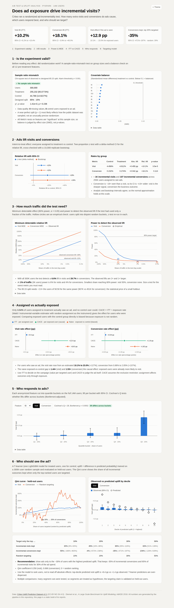
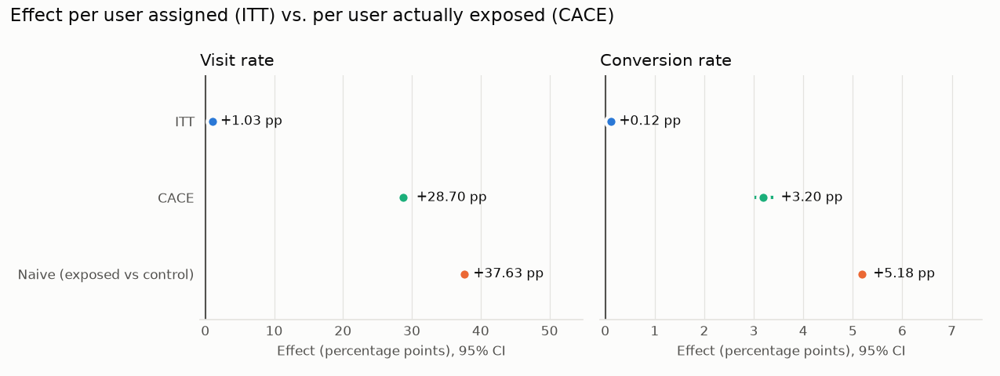
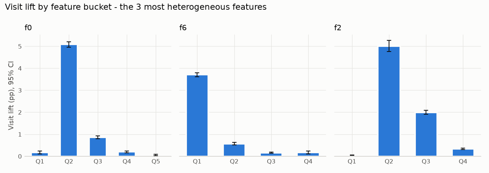
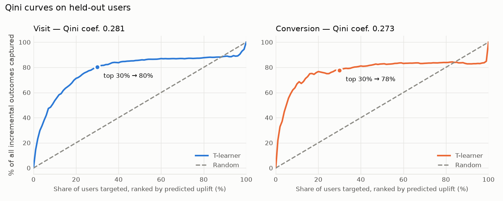
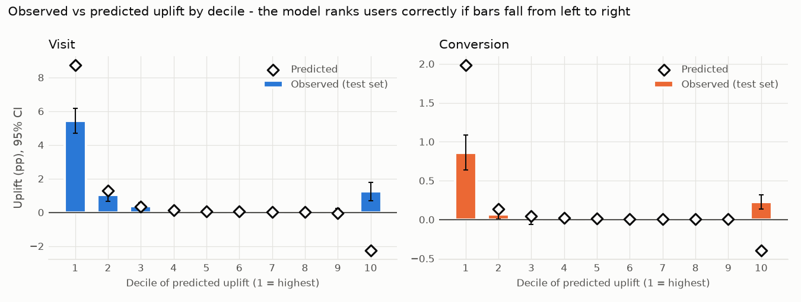

# Does Ad Exposure Drive Incremental Visits? — A/B Test & Uplift Analysis on 14M Users (PySpark)

> **Business question:** Criteo ran a randomized ad-incrementality test. How many *extra* visits and
> conversions do ads actually cause, which users respond best, and who should we target?

**📊 [Interactive dashboard](https://shyanne257.github.io/criteo-uplift-ab-test/)** · static page, no server, loads instantly



## TL;DR

| Question | Answer |
|---|---|
| Is the experiment trustworthy? | **Yes.** No sample ratio mismatch (p = 0.999); all 12 features balanced (max \|SMD\| 0.049). |
| Do ads work? | **Yes.** Visit rate **+27.1%** (95% CI 26.2–28.0%), conversion rate **+59.4%** (54.4–64.7%): ≈ **123K incremental visits** and **13.7K incremental conversions** from 11.9M users assigned to ads. |
| How big is the effect for people who actually see an ad? | Only 3.6% of assigned users were exposed. For them the visit rate rose from an estimated **12.8% to 41.5%** (CACE +28.7 pp). Comparing exposed users with control naively overstates the conversion effect by **62%**. |
| Was the test big enough? | Far bigger than needed: **1% of the traffic** would still have detected the conversion lift with 85% power (confirmed empirically on 100 disjoint 1% buckets). |
| Who should we target? | The effect is concentrated. Showing ads only to the **top 30%** of users by predicted uplift keeps **78% of incremental conversions** (95% CI 71–87%) and **80% of incremental visits**. |

## Methods at a glance

| Step | What | Key technique | Report |
|---|---|---|---|
| 1 | Ingest 14M rows, data-quality profile, Parquet | PySpark, explicit schema, one-pass aggregations | [01](reports/01_data_profile.md) |
| 2 | Experiment validity | SRM chi-square test, standardized mean differences | [02](reports/02_validity.md) |
| 3 | Core A/B analysis | Two-proportion z-test, delta-method CI, binomial bootstrap | [03](reports/03_ab_results.md) |
| 4 | Power & MDE | Analytic power curves, empirical power via disjoint buckets, allocation cost | [04](reports/04_power_mde.md) |
| 5 | Assignment vs. exposure | ITT vs. CACE (Wald / IV estimator), selection-bias check | [05](reports/05_itt_cace.md) |
| 6 | Heterogeneous effects & targeting | Cochran's Q + Bonferroni/BH, T-learner (LightGBM), Qini curves | [06](reports/06_heterogeneity_uplift.md) |
| 7 | Dashboard | Static interactive page built from the step reports (GitHub Pages) | [docs/](docs/index.html) |

## Detailed results

### 1. Data: 13.98M users, clean, processed in ~60s with PySpark
- **13,979,592** users; **0** missing values; all binary columns valid.
- Treatment 11,882,655 (85%) vs. control 2,096,937 (15%).
- Overall visit rate **4.70%**, conversion rate **0.29%**, exposure rate **3.06%** — only
  **~3.6% of treated users actually saw an ad**, which matters for Step 5 (ITT vs. CACE).
- Integrity checks: **0** control users exposed to the ad, **0** conversions without a visit.
- 9.0% of rows are exact duplicates. They are **kept**: each row is a distinct user and the
  anonymised features collide naturally; dropping them would bias the rates.

### 2. Randomisation is valid → treatment effects can be trusted
- **No sample ratio mismatch.** Observed treatment share 85.00001% vs. designed 85%
  (χ² = 1.8e-6, p = 0.999). The split is almost *too* exact — the public release was most likely
  subsampled to the target ratio, so this test confirms the data was prepared consistently rather
  than proving the live randomiser was perfect.
- **Covariates are balanced.** All 12 features have |SMD| < 0.1 (largest: f3, 0.049); variance
  ratios 0.99–1.32.
- **Why SMD and not p-values:** all 12 Welch t-tests are "significant" (p < 0.05) purely because of
  sample size — with 14M users even a 0.01-SD difference is detectable. Balance is judged on effect
  size, not significance.


### 3. Ads cause +27% visits and +59% conversions (intent-to-treat)

| Metric | Control | Treatment | Abs. lift | Rel. lift (95% CI) | p-value |
|---|---|---|---|---|---|
| Visit | 3.820% | 4.854% | +1.034 pp | **+27.1%** (26.2%, 28.0%) | < 1e-300 |
| Conversion | 0.194% | 0.309% | +0.115 pp | **+59.4%** (54.4%, 64.7%) | 7e-179 |

- **Two methods, same answer:** two-proportion z-test (delta-method CI for relative lift) and a
  10,000-replicate bootstrap agree to within 0.2 percentage points of lift.
- **Efficient bootstrap:** with binary outcomes and i.i.d. users, resampling *n* users gives a
  Binomial(*n*, p̂) success count, so replicates are drawn from that distribution — equivalent to a
  row-level bootstrap without rescanning 14M rows 10,000 times.
- **Signal vs noise:** conversion is ~20× rarer than a visit, so its relative-lift CI is ~5.6×
  wider (10.3 vs 1.8 pts). Visit is the sharper signal; conversion is the business outcome.
- These are **intent-to-treat** effects: only ~3.6% of assigned users actually saw an ad, so the
  effect on users who *were* exposed is much larger (Step 5).


### 4. The test is ~12–26× over-powered; 1% of traffic would still have been enough

| Metric | MDE, full sample (80% power) | Observed lift | Power at 1% traffic (140K users) | Smallest traffic reaching 80% power |
|---|---|---|---|---|
| Visit | 1.05% | +27.1% (26× MDE) | 100% | 0.2% |
| Conversion | 4.76% | +59.4% (12× MDE) | 85% | 1.0% |

- **Analytic power is confirmed on real data.** Users were split at random into *k* disjoint
  buckets (each a mini-experiment with 1/*k* of the traffic) and the z-test re-run in every bucket
  in a single Spark `groupBy`. The share of significant buckets matches the formula almost exactly:

  | Traffic per bucket | Visit: empirical / analytic | Conversion: empirical / analytic |
  |---|---|---|
  | 1% (100 buckets) | 100% / 100% | 85.0% / 85.3% |
  | 0.1% (1,000 buckets) | 53.9% / 54.5% | 9.6% / 10.7% |

- **Size the test for the hardest metric.** Conversion needs 5× more traffic than visits to reach
  80% power (1.0% vs 0.2%). Planning on visit alone would under-power the business outcome.
- **The 85:15 split costs ~2× sample size.** Detecting the observed conversion lift needs 123K users
  at 85:15 vs 59K at 50:50 (variance ∝ 1/(0.85·0.15) = 7.84 vs 4). A small holdout limits lost
  revenue from users who never see ads; the statistical price is a larger required sample.


### 5. For users who actually saw an ad, the effect is ~28× larger (ITT vs. CACE)

Only **3.60%** of treated users were actually exposed; no control user was (one-sided
non-compliance). CACE = ITT ÷ exposure rate — the Wald / instrumental-variable estimator with random
assignment as the instrument — so here it equals the effect on users who saw an ad.

| Metric | ITT (per assigned user) | CACE (per exposed user), 95% CI | Exposed users' rate | Same users without the ad (est.) | Relative lift for exposed |
|---|---|---|---|---|---|
| Visit | +1.03 pp | **+28.7 pp** (27.9, 29.5) | 41.5% | 12.8% | **+225%** |
| Conversion | +0.115 pp | **+3.20 pp** (3.01, 3.38) | 5.38% | 2.18% | **+146%** |

- **Use ITT to decide on the campaign, CACE to judge the ad itself.** ITT is what the business gets
  per targeted user; CACE is what an impression does to someone who sees it.
- **Dividing by 3.6% amplifies noise ~28×** — CACE's CI is ~28× wider in absolute terms. Delta-method
  (with the ITT–exposure covariance) and multinomial-bootstrap CIs agree.
- **The naive comparison is biased.** Comparing exposed users with the control group overstates the
  effect by **1.31× (visit) and 1.62× (conversion)**. Exposure is not random: 11 of 12 features
  differ between exposed and unexposed treated users with |SMD| ≥ 0.1 (up to 1.47 for f3), versus
  0 of 12 between the randomised groups. Exposed users would have visited 3× more often than
  average (12.8% vs 3.8%) even without the ad.
- **Assumptions:** random assignment (Step 2); exclusion restriction (assignment affects outcomes
  only through exposure — violated if some impressions were not logged); monotonicity (trivially
  true, control cannot be exposed).



### 6. The effect is concentrated: targeting the top 30% keeps ~80% of the incremental value

**Segment analysis (full 14M, PySpark).** Each feature was cut into quantile buckets and the lift
estimated per bucket; Cochran's Q tests whether lifts differ across buckets.
- 9 of 12 features show significant heterogeneity after Bonferroni correction (24 tests), for both
  visit and conversion. (f3, f5, f11 are so concentrated on one value that they form a single
  bucket and cannot be tested.)
- The lift is concentrated in small, high-intent segments. Example, **f2**:

  | f2 bucket | Users | Visit rate C → T | Visit lift | Conversion lift |
  |---|---|---|---|---|
  | ≤ 8.21 | 7.3M (52%) | 0.10% → 0.15% | +0.05 pp | +0.003 pp |
  | (8.21, 8.38] | 1.1M (8%) | 30.0% → 35.0% | **+5.01 pp** | **+0.84 pp** |
  | (8.38, 8.81] | 2.8M (20%) | 7.0% → 9.0% | +2.00 pp | +0.18 pp |
  | > 8.81 | 2.8M (20%) | 0.88% → 1.22% | +0.33 pp | +0.02 pp |

  Half of all users barely respond; 8% of users show a lift 100× larger.
- **Multiple comparisons:** with many cuts some segments look significant by chance, so segment
  findings are treated as hypotheses; p-values are Bonferroni- (per feature) and
  Benjamini–Hochberg- (per bucket) adjusted, and the targeting claim is validated out of sample.

**T-learner uplift model.** 2M-user random sample, 50/50 train/test split. Two LightGBM classifiers
(treated / control) per outcome; uplift(x) = P(y | x, T) − P(y | x, C). Evaluated on held-out users.

| Targeting only the top … by predicted uplift | 10% | 20% | **30%** | 50% |
|---|---|---|---|---|
| Share of incremental **visits** kept | 54% | 71% | **80%** (75–85%) | 86% |
| Share of incremental **conversions** kept | 67% | 77% | **78%** (71–87%) | 83% |
| Random targeting | 10% | 20% | 30% | 50% |

Qini coefficients: 0.281 (visit), 0.273 (conversion). Bootstrap 95% CIs in brackets.

- **Recommendation:** restrict ads to the top ~30% of users by predicted uplift — about 70% less
  ad spend for roughly 20% fewer incremental conversions.
- **Use the model for ranking, not absolute values.** Top-decile predicted visit uplift is +8.7 pp
  vs +5.4 pp observed: T-learner predictions are over-dispersed because the two models' errors do
  not cancel. The Qini curve depends only on the ranking.
- **Known weakness — the bottom decile.** Users predicted to have the most *negative* uplift
  (−2.2 pp) actually show a significantly *positive* one (+1.2 pp, CI 0.7–1.8). These are
  high-activity users where the small control-group model is noisy. Extreme negative predictions
  should not be read as "ads hurt"; an X-learner or a directly-trained uplift model would be the
  next thing to try.





## Limitations & next steps

- **Anonymised features:** segments cannot be described in business terms (e.g. "frequent shoppers").
- **Exclusion restriction:** CACE assumes assignment affects outcomes only through logged exposure.
- **Bottom-decile mis-ranking:** the T-learner's most negative predictions are unreliable (Step 6);
  next: X-learner / directly trained uplift models, and cost-aware targeting (uplift × margin − ad cost).
- **Public dataset:** the near-exact 85:15 split suggests the release was subsampled, so the SRM check
  validates data preparation rather than the live randomiser.

## Data

[Criteo Uplift Prediction Dataset v2.1](https://huggingface.co/datasets/criteo/criteo-uplift):
~13.98M users, 12 anonymised features (`f0`–`f11`), `treatment` (≈85% treated),
`visit`, `conversion`, `exposure`. License: CC-BY-NC-SA 4.0 (non-commercial). The data is not
redistributed in this repo — `scripts/00_download_data.sh` fetches it.

## Project structure

```
├── scripts/
│   ├── 00_download_data.sh        # fetch raw data from Hugging Face
│   ├── make_sample_data.py        # tiny synthetic file with the same schema (for quick runs / CI)
│   ├── 01_ingest_and_profile.py   # Step 1: PySpark ingest -> profile -> Parquet
│   ├── 02_validity_checks.py      # Step 2: SRM chi-square test + covariate balance (SMD)
│   ├── 03_ab_analysis.py          # Step 3: z-tests, delta-method & bootstrap CIs
│   ├── 04_power_mde.py            # Step 4: MDE, power curves, empirical power, allocation cost
│   ├── 05_itt_cace.py             # Step 5: ITT vs CACE (IV/Wald), naive-comparison bias
│   ├── 06_heterogeneity_uplift.py # Step 6: segment HTE (Cochran's Q) + T-learner, Qini
│   └── 07_build_dashboard.py      # Step 7: static interactive dashboard -> docs/index.html
├── src/criteo_ab/
│   ├── spark.py                   # SparkSession factory + explicit schema
│   └── dashboard_template.html    # dashboard page (data injected at build time)
├── docs/index.html                # built dashboard, served by GitHub Pages
├── reports/                       # generated reports and figures
└── data/{raw,processed}/          # git-ignored
```

## How to run

Requires Python 3.10+ (3.11 recommended; on 3.12+ the `setuptools` package in requirements.txt
supplies the removed `distutils` module) and Java 17 (for Spark).

```bash
python -m venv .venv && source .venv/bin/activate
pip install -r requirements.txt

# real data (~311 MB download)
bash scripts/00_download_data.sh
python scripts/01_ingest_and_profile.py
python scripts/02_validity_checks.py
python scripts/03_ab_analysis.py
python scripts/04_power_mde.py
python scripts/05_itt_cace.py
python scripts/06_heterogeneity_uplift.py
python scripts/07_build_dashboard.py      # -> docs/index.html

# or: synthetic sample, runs in ~30s (numbers are NOT real results)
python scripts/make_sample_data.py
python scripts/01_ingest_and_profile.py --input data/raw/sample.csv.gz
python scripts/02_validity_checks.py
python scripts/03_ab_analysis.py
python scripts/04_power_mde.py
python scripts/05_itt_cace.py
python scripts/06_heterogeneity_uplift.py
python scripts/07_build_dashboard.py      # -> docs/index.html
```

### Why Spark for 14M rows?
Pandas could hold this dataset, but the pipeline is written against the Spark DataFrame API so the
same code scales to the original 25M-row release or to production-sized experiment logs without a
rewrite. For example, balance statistics for all 12 features × 2 groups come from a single Spark
aggregation, so no raw rows are pulled into Python.

## Citation

Diemert, E., Betlei, A., Renaudin, C., & Amini, M.-R. (2018). *A Large Scale Benchmark for Uplift
Modeling.* AdKDD & TargetAd Workshop, KDD 2018.
