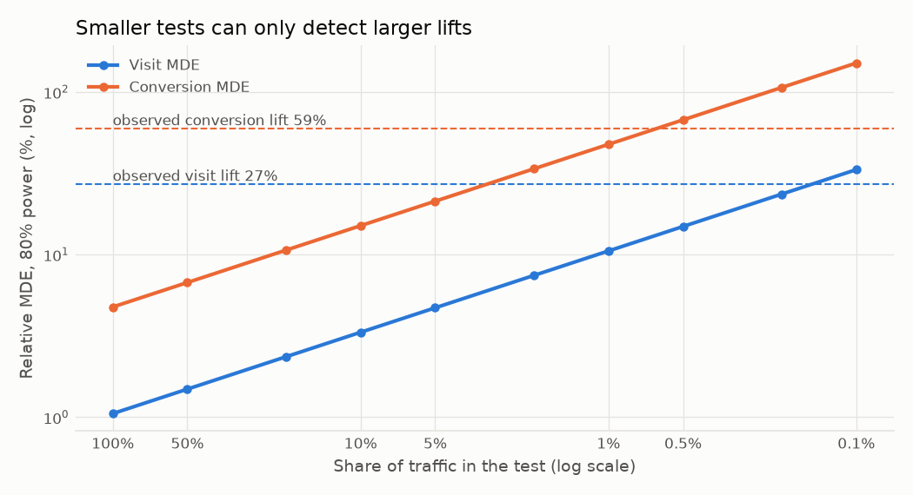
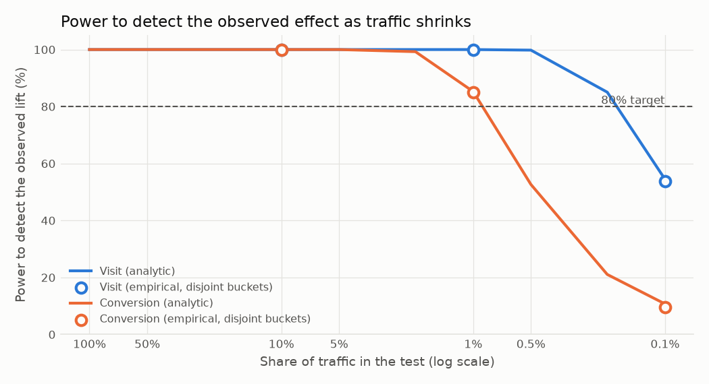

# Step 4 - Power & minimum detectable effect

Two-sided α = 0.05, target power = 80%, allocation 85:15 (as run). Baselines are the control-group rates.

## 1. MDE with the full sample

| Metric | Control rate | MDE (abs) | MDE (relative) | Observed lift | Observed / MDE |
|---|---|---|---|---|---|
| visit | 3.8201% | 0.0402 pp | 1.05% | +27.07% | 26x |
| conversion | 0.1938% | 0.0092 pp | 4.76% | +59.45% | 12x |

## 2. What if the test had used less traffic?

| Traffic | Users | Visit MDE (rel) | Power: visit | Conversion MDE (rel) | Power: conversion |
|---|---|---|---|---|---|
| 100.0% | 13,979,592 | 1.1% | 100.0% | 4.8% | 100.0% |
| 50.0% | 6,989,796 | 1.5% | 100.0% | 6.7% | 100.0% |
| 20.0% | 2,795,918 | 2.4% | 100.0% | 10.6% | 100.0% |
| 10.0% | 1,397,959 | 3.3% | 100.0% | 15.1% | 100.0% |
| 5.0% | 698,980 | 4.7% | 100.0% | 21.3% | 100.0% |
| 2.0% | 279,592 | 7.4% | 100.0% | 33.7% | 99.3% |
| 1.0% | 139,796 | 10.5% | 100.0% | 47.6% | 85.3% |
| 0.5% | 69,898 | 14.9% | 99.8% | 67.4% | 52.6% |
| 0.2% | 27,959 | 23.5% | 85.0% | 106.5% | 21.1% |
| 0.1% | 13,980 | 33.3% | 54.5% | 150.6% | 10.7% |

## 3. Empirical check on the real data

Users are randomly split into *k* disjoint buckets (each bucket = 1/k of traffic, same 85:15 split); the z-test is re-run in every bucket in one Spark `groupBy`.

| Traffic per bucket | Buckets | Visit: share significant | Visit: analytic power | Conversion: share significant | Conversion: analytic power |
|---|---|---|---|---|---|
| 10.0% | 10 | 100.0% | 100.0% | 100.0% | 100.0% |
| 1.0% | 100 | 100.0% | 100.0% | 85.0% | 85.3% |
| 0.1% | 1000 | 53.9% | 54.5% | 9.6% | 10.7% |

## 4. Cost of the 85:15 allocation

| Metric | Users needed at 85:15 | Users needed at 50:50 | Ratio |
|---|---|---|---|
| visit | 24,596 | 12,176 | 2.02x |
| conversion | 123,116 | 59,324 | 2.08x |

## Takeaways

- With 13,979,592 users the test could detect a 1.1% relative lift in visits and 4.8% in conversions at 80% power; the observed lifts are 26x and 12x those thresholds.
- **At 1% of traffic** (139,796 users) power is 100% for visits and 85% for conversions: both effects would still be detected reliably.
- Smallest traffic share (of those tested) that still reaches 80% power: visit 0.2%, conversion 1.0%.
- Rare metrics drive sample size: to plan a test, size it for the *hardest* metric you must read (here conversion), not the easiest.
- An 85:15 split needs ~2.0x the users of a 50:50 split for the same power (variance ∝ 1/(0.85·0.15) = 7.84 vs 1/(0.5·0.5) = 4). Unequal splits are chosen to limit the business cost of the control holdout, and this is the statistical price.

_Runtime: 6.1s_
